# 📙LecturePedia

> SpringBoot와 Spring Data JPA를 사용하여 웹 게시판 구현하기

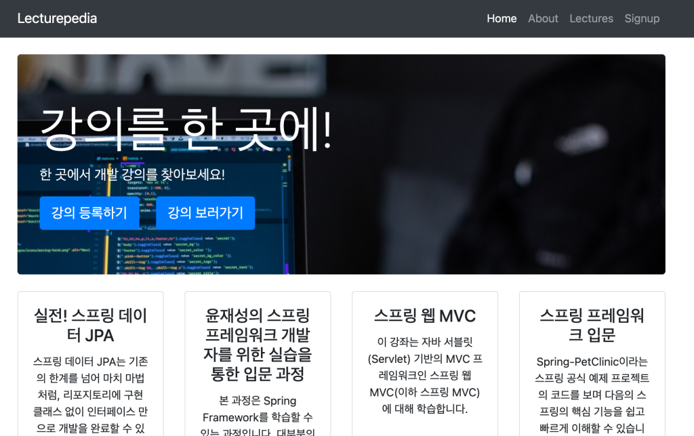

## ToC

1. [기술 스택](#1)
3. [핵심 기능](#2)
4. [트러블 슈팅](#3)
5. [프로젝트를 통해 배운  것](#4)

 

## [🔝](#toc)<a name="1">1. 기술 스택</a>

<table>
  <tr>
    <th style="width: 20%;">Spring Boot</th>
    <td>본 프로젝트는 Spring Boot 2.4.5로 개발하였습니다.</td>
  </tr>
  <tr>
    <th style="width: 20%;">Spring Data JPA</th>
    <td>JPA에서 자동생성해주는 메소드를 사용하여 쿼리를 직접 작성하는대신 OOP에 집중하며 개발할 수 있었습니다. </td>
  </tr>
  <tr>
    <th style="width: 20%;">Spring Security</th>
    <td>회원가입과 로그인 과정에서 사용자의 비밀번호를 평문대신 Bcrypt 해시함수로 인코딩한 값을 저장하였습니다.</td>
  </tr>
  <tr>
    <th style="width: 20%;">Ajax</th>
    <td>회원가입 과정에서 이메일 중복검사를, 로그인 과정에서 이메일/비밀번호 검증을 Ajax로 검증하였습니다.</td>
  </tr>
  <tr>
    <th style="width: 20%;">Mustache</th>
    <td>화면에서 로직을 사용하지 않는 템플릿 엔진, Mustache를 사용하여 화면을 구현했습니다.</td>
  </tr>
  <tr>
    <th style="width: 20%;">Lombok</th>
    <td>VO 필드를 추가하거나 삭제할때 Getter/Setter를 작업하는 대신 Lombok 라이브러리를 사용하여 불필요한 코드 작성을 최소화하였습니다.</td>
  </tr>
  <tr>
    <th style="width: 20%;">H2 Databse</th>
    <td>로컬 환경에서 개발할 때 편리한 개발을 위해 H2 데이터베이스를 사용하여 개발했습니다.</td>
  </tr>
  <tr>
    <th style="width: 20%;">MySQL</th>
    <td>영속적인 데이터 사용을 위해 MySQL을 RDBMS로 사용했습니다.</td>
  </tr>
  <tr>
    <th style="width: 20%;">Docker</th>
    <td>MySQL을 컨테이너 기반으로 사용하기 위해 Docker를 사용했습니다.</td>
  </tr>
  <tr>
    <th style="width: 20%;">JUnit5</th>
    <td>서비스 로직 검증을 위해 테스트 프레임워크를 사용했습니다.</td>
  </tr>
</table>

 

## [🔝](#toc)<a name="2">2. 핵심 기능</a>

- [비밀번호 암호화](#2-1)
- [admin 권한 부여 및 사용자 관리](#2-2)

- [조회수 기능 추가 (작성자 본인 또는 Admin은 조회수 카운팅✖︎)](#2-3)
- [메인 페이지에서 조회수 높은 4개의 게시글 노출](#2-4)
- [최근작성순으로 게시글 정렬 및 한 페이지에 게시글 5개씩 노출되도록 페이징 구현](#2-5)

### [🔝](#2) <a name="2-1">2-1. 비밀번호 암호화</a>

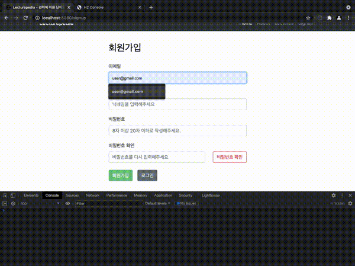

Spring Security에 내장된 Password 인터페이스의 `encode()`를 사용하여 비밀번호를 암호화하였습니다. 이렇게 암호화한 비밀번호는 서버에서 평문 비밀번호를 알 수 없으므로 `equals()` 대신 Password 인터페이스에 내장된 `matches()` 를 사용하여 사용자가 입력한 평문 비밀번호와 서버에 저장된 인코딩된 비밀번호를 비교하여 반환된 boolean 값을 통해 로그인을 검증하였습니다. 

**userLogin.html**

~~~html
<button class="btn btn-success pull-right"
      style="margin-top: 1.5em;"
      onclick="validationLogin();"
      type="button">로그인</button>
~~~

Form안에 버튼을 생성해서 버튼을 클릭하면, 자바 스크립트로 작성된 로그인 검증 함수(`function validationLogin()`)가 실행되도록 하였습니다. 일반적으로 Form 안에 버튼을 생성하면 submit이 되므로 `type="button"` 속성을 추가하여 자동으로 submit되지 않고 `validationLogin()` 에 의해 submit되도록 하였습니다.

~~~javascript
function validationLogin() {
   let email = document.getElementById('email').value;
   let password = document.getElementById('password').value;
   let loginForm = document.loginForm;

   let isOkEmail = validationEmail(email);
   if(isOkEmail) {
   let isOkPassword = validationPassword(email, password);
      if(isOkPassword) {
         alert("Welcome back!");
         loginForm.submit();
      } else { alert("비밀번호를 잘못 입력하였습니다."); }
   } else { alert("이메일을 잘못 입력하였습니다."); }
}
~~~

로그인 검증 함수가 실행되면 사용자가 입력한 이메일과 비밀번호를 화면에서 가져와서 각각을 다시 검증하는 Ajax를 실행하여 반환되는 결과(`boolean`)에 따라 어떤 영역에서 잘못되었는지를 화면에서 알려주고, 모든 검증을 통과하면 Form이 submit되도록 하였습니다.

사용자의 이메일을 통해 Repository를 조회하여 인코딩된 비밀번호를 접근할 수 있으므로 이메일 검증이 통과하지 못하면 비밀번호 검증 함수가 error를 반환하게 됩니다. 따라서 이메일 검증에서 true를 반환받은 경우에만 비밀번호 검증 함수를 실행하도록 Ajax 함수를 동기적(`async: false`)으로 수행하도록 하였습니다.

~~~javascript
function validationPassword(email, password) {
   let result = false;
   $.ajax({
      type: 'POST',
      url: '/user/passwordChk',
      async: false,
      dataType: 'json',
      data: {
         'email': email,
         'password': password
      },
      success: function(data) {
         if(data) {
            result = true;
         }
      },
      error: function(error){
         alert("비밀번호 검증 오류 !!");
         alert(error);
      }
   });
   return result;
}
~~~

API 요청의 결과를 boolean 타입으로 받아서 반환값에 따라 다음 스크립트 함수를 실행하도록 하였습니다. 

**UserController.java**

~~~java
@RequestMapping(value = "/user/passwordChk", method = RequestMethod.POST)
public @ResponseBody boolean validationPasswordByLogin(@RequestParam String email, @RequestParam String password) {
   return userService.validationLoginByPassword(email, password);
}
~~~

`Model`을 반환하는 컨트롤러가 아닌 `boolean` 타입의 entity를 반환하는 컨트롤러이므로 `@ResponseBody` 어노테이션을 사용했습니다.

실제 비밀번호를 비교하는 메소드는 아래와 같습니다.

**UserServiceImpl.java**

~~~java
@Override
public boolean validationLoginByPassword(String email, String password) {
   User targetUser = userRepository.findByEmail(email);
   return passwordEncoder.matches(password, targetUser.getPassword());
}
~~~

실제로 `passwordEncoder.matches()`가 잘작동하는지 테스트를 실행했습니다.

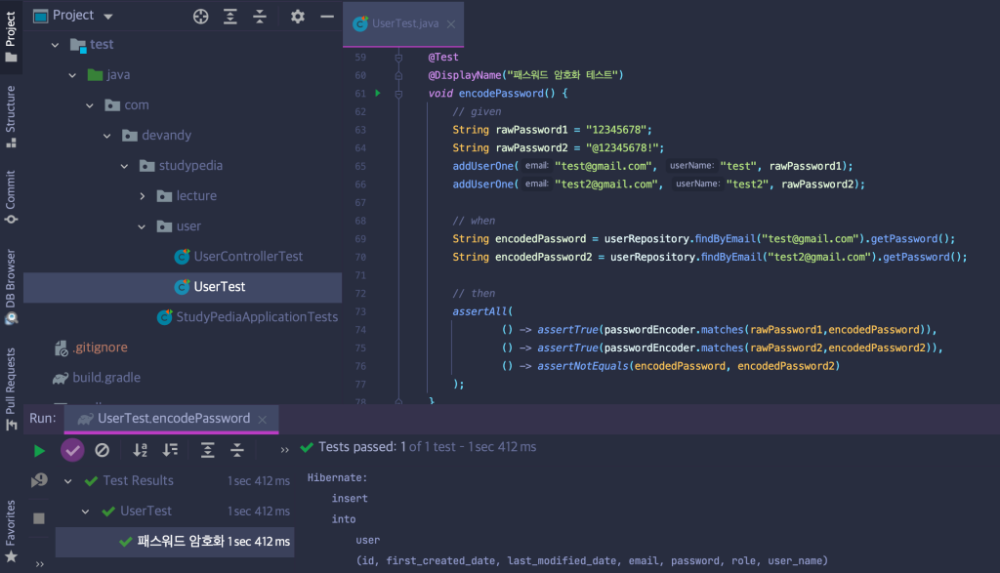

 

### [🔝](#2) <a name="2-2">2-2. admin 권한 부여 및 사용자 관리</a>

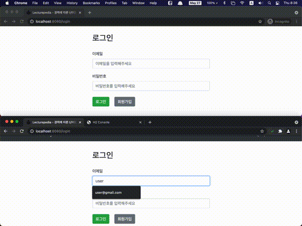

Enum으로 생성된  `Role`이 `Role.Admin`이면 메인페이지에서 사용자 목록 페이지에 접근할 수 있으며, 여기서 사용자를 삭제할 수 있습니다.

또한 Admin은 모든 게시글에 대해 삭제 권한을 갖고있습니다.  

**UserController.java**

~~~java
@GetMapping("/user/list")
public String userList(HttpSession session, Model model) {
   if(HttpSessionUtils.hasRoleLoginUser(session, Role.ADMIN)) {
      model.addAttribute("users",userService.getAllUsers());
      return "user/userList";
   }
   return "redirect:/";
}
~~~

**HttpSessionUtils.java**

~~~java
public static boolean isLoginUser(HttpSession session) {
   if(getUserFromSession(session)==null) {
      return false;
   }
   return true;
}

public static boolean hasRoleLoginUser(HttpSession session, Role role) {
   if(isLoginUser(session)) {
      Role roleOfCurrentUser = getUserFromSession(session).getRole();
      return roleOfCurrentUser.equals(role);
   }
   return false;
}
~~~

컨트롤러를 통해 사용자 목록 조회 API 요청이 들어오면, 세션관련 메소드를 분리한 싱글톤 객체 `HttpSessionUtils`의 메소드를 이용하여 현재 세션의 사용자가 `Role.ADMIN`의 권한이 있는지를 검증합니다. 권한이 있다면 사용자 목록 페이지를 반환해주고, 그렇지 않으면 다시 메인페이지로 반환합니다.

 

### [🔝](#2) <a name="2-3">2-3. 조회수 기능 추가</a>

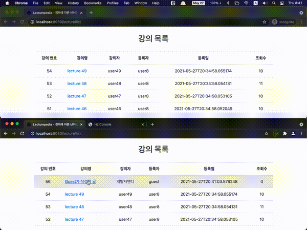

게시글에 접근하면 조회수가 올라갑니다. 그러나 게시글 작성자 본인 또는 Admin이라면 게시글 조회수는 올라가지 않도록 검증 로직을 구현하였습니다.

~~~java
@GetMapping("/lecture/{lectureId}")
public String getLecture(@PathVariable Long lectureId, Model model, HttpSession session) {
   if(!HttpSessionUtils.isLoginUser(session)) {
      return "redirect:/login";
   }
   if(userService.hasAuthority(lectureId, session)) {
      model.addAttribute("authority", true);
   } else {
      lectureService.increaseViewCount(lectureId);
   }
   Lecture targetLecture = lectureService.getLecture(lectureId);
   model.addAttribute("lecture",targetLecture);
   return "lecture/detailLecture";
}
~~~

게시글에 접근하는 API 요청이 컨트롤러로 들어오면, 우선 로그인한 사용자인지부터 검증하고, 로그인한 사용자라면 권한을 검증하였습니다. 

만약 게시글 작성자거나 Admin이면, 게시글의 수정 또는 삭제 버튼이 보여지도록 `Model`에 boolean값을 담았습니다.

~~~html
{{#authority}}
<a href="/lecture/update/{{lecture.id}}">
  <button class="btn btn-success pull-right" style="float: left; margin-top: 1em; margin-left: 1em">수정하기</button>
</a>
<button class="btn btn-danger pull-right"
        style="margin-top: 1em; margin-left: 1em"
        onclick="deleteLecture();">삭제하기</button>
{{/authority}}
~~~

컨트롤러를 통해 넘어온 Model 객체중 `"authority"` 이름의 객체가 있다면, 수정/삭제하기 버튼을 출력합니다.

게시글 작성자 또는 Admin이 아니라면 조회수를 증가하는 서비스 로직을 호출했습니다.

~~~java
@Override
public void increaseViewCount(Long id) {
   Lecture targetLecture = getLecture(id);
   targetLecture.setViews(targetLecture.getViews()+1);
   lectureRepository.save(targetLecture);
}
~~~

 

### [🔝](#2) <a name="2-4"> 2-4. 메인 페이지에서 조회수 높은 4개의 게시글 노출

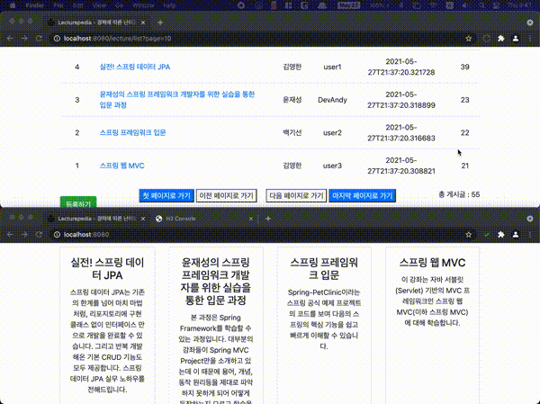

조회수 높은 4개의 게시글을 메인 페이지에 노출시키는 로직을 구현하였습니다. 이를 위해 Repository에서 조회수 기준으로 상위 4개의 게시글을 불러오는 메소드를 선언했습니다.

~~~java
@Repository
public interface LectureRepository extends JpaRepository<Lecture, Long> {
   List<Lecture> findTop4ByOrderByViewsDesc();
~~~

JpaRepository를 상속받는 `LectureRepository`에서 `findTop4ByOrderByViewsDesc()`를 선언하면 Hibernate에서 자동으로 쿼리를 생성하는데 이 때 생성되는 쿼리는 아래의 쿼리와 같습니다.

~~~sql
SELECT * FROM Lecture Order BY views DESC LIMIT 4;
~~~

Hibernate에서 생성하는 쿼리를 콘솔에 출력되도록 application.properties에 설정을 추가해서 확인한결과 아래의 쿼리를 생성하는걸 확인하였습니다.

~~~properties
spring.jpa.show-sql=true
~~~

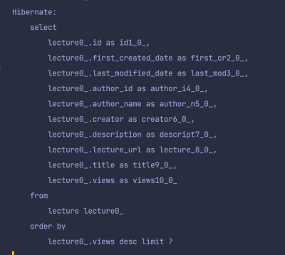

  

### [🔝](#2) <a name="2-5"> 2-5. 최근작성순으로 게시글 정렬 및 한 페이지에 게시글 5개씩 노출되도록 페이징 구현

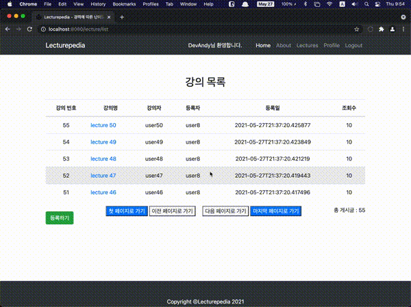

한 페이지에 강의 5개만 보이도록 페이징을 구현하였습니다.

Jpa에서는 `Pageable`을 이용해서 간단하게 페이징을 구현할 수 있었습니다. 

**LectureController.java**

~~~java
@GetMapping("/lecture/list")
public String retrievePosts(final @PageableDefault(size = 5, page = 0) Pageable pageable, Model model) {
   if(lectureService.isEmptyList()) {
      return "redirect:/lecture/register";
   }

   Page<Lecture> lecturesForPage = lectureService.getLecturesByPagination(pageable);
   List<Lecture> lectures = lecturesForPage.getContent();
   model.addAttribute("lectures", lectures);

   long totalCount = lectureService.getLecturesTotalCount();
   model.addAttribute("totalCount",totalCount);
   return "lecture/listLecture";
}
~~~

`@PageableDefault` 어노테이션을 사용해서 페이징의 디폴트를 설정하였습니다. `size`는 한 페이지에 보여줄 객체수를, `page`는 API 요청이 들어왔을때 보여질 페이지 번호를 의미합니다. 

**LectureServiceImpl.java**

~~~java
@Override
public Page<Lecture> getLecturesByPagination(Pageable pageable) {
   return lectureRepository.findAllByOrderByFirstCreatedDateDesc(pageable);
}
~~~

Repository에서 `findAllByOrderByFirstCreatedDateDesc()` 메소드를 생성해서 서비스에서 호출하는 코드를 작성하였습니다.

**LectureRepository.java**

~~~java
@Repository
public interface LectureRepository extends JpaRepository<Lecture, Long> {
   Page<Lecture> findAllByOrderByFirstCreatedDateDesc(Pageable pageable);
~~~

위의 Jpa 메소드를 통해 Hibernate가 생성하는 쿼리는 아래와 같습니다.

~~~sql
SELECT * FROM Lecture Order By firstCreatedDate DESC LIMIT 5 OFFSET 40
~~~

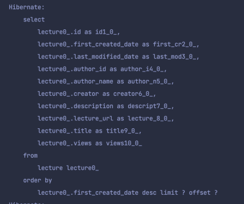

 

## [🔝](#toc)<a name="3">3. 트러블 슈팅</a>

### 3-1. Ajax 동기 호출

[로그인 검증 코드](https://github.com/youngjinmo/LecturePedia/blob/mysql/src/main/resources/templates/user/userLogin.html)

로그인 검증을 하는 과정에서 자바 스크립트 함수를 3개를 사용했습니다. 하나는 이메일 검증, 하나는 비밀번호 검증 그리고 하나는 앞선 두 개의 함수를 호출하는 함수였습니다. 이메일 함수까지는 문제가 없었으나 비밀번호 검증 함수를 호출하는 과정에서 의도와 다르게 API 결과를 제대로 가져오지 못하는 현상이 발생했습니다.

문제의 원인은 Ajax가 기본적으로 비동기로 작동한다는 점을 인지하지 않고 스크립트 함수를 순차적으로 호출한 제 잘못이었습니다. 

로그인 과정에서의 검증은 아래의 순서대로 진행되어야 했습니다.

1. 이메일 검증
2. 이메일 검증이 통과되었다면, 해당 이메일과 비밀번호를 파라미터로 API호출하여 비밀번호 검증
3. 비밀번호 검증까지 통과했다면, submit 호출 

따라서 로그인 검수의 모든 스크립트 함수가 순차적으로 호출될수 있도록 `async=false`로 지정하였더니 의도한대로 로그인 검증을 할 수 있었습니다.

 

### 3-2. RDBMS 변경(H2->MySQL)

인메모리 기반의 h2데이터 베이스에서 영속적으로(persistence) 사용할 수 있는 MySQL을 사용하기 위해 RDBMS를 변경을 시도했습니다. 

먼저 도커에서 MySQL 이미지를 내려받아 컨테이너를 생성했습니다.

~~~bash
docker search mysql
docker pull mysql

docker run -p 3306:3306 --name mysql -e MYSQL_ROOT_PASSWORD=password mysql
~~~

그리고 컨테이너에 접속하여, MySQL를 실행했습니다.

~~~bash
docker exec -it mysql bash
root@528e18f1f85b:/# mysql -uroot -p
~~~

이후부터 순차적으로 사용자 계정을 생성하고, 데이터베이스와 테이블을 생성했습니다.

~~~sql
CREATE USER devandy@'%' identified by 'password';
CREATE DATABASE lecturepedia;
~~~

~~~sql
create table lecture (
   id bigint primary key auto_increment,
   first_created_date timestamp,
   last_modified_date timestamp,
   author_id bigint,
   author_name varchar(255),
   creator varchar(255) not null,
   description varchar(255) not null,
   lecture_url varchar(255) not null,
   title varchar(255) not null,
   views bigint
);

create table user (
   id bigint primary key auto_increment,
   first_created_date timestamp,
   last_modified_date timestamp,
   email varchar(255) not null,
   password varchar(255) not null,
   role varchar(255) not null,
   user_name varchar(255) not null
);
~~~

이제 MySQL과 관련한 Gradle 의존성을 주입했습니다.

~~~groovy
implementation group: 'mysql', name: 'mysql-connector-java', version: '8.0.25'
implementation group: 'org.springframework.boot', name: 'spring-boot-starter-data-jdbc', version: '2.5.0'
~~~

 그리고 application.properties를 수정했습니다. H2 관련 속성은 모두 주석처리하고, MySQL 관련 속성을 추가해주었습니다.

~~~properties
spring.datasource.driver-class-name=com.mysql.cj.jdbc.Driver
spring.datasource.url=jdbc:mysql://localhost:3306/lecturepedia
spring.datasource.username=devandy
spring.datasource.password=password
~~~

Docker로 MySQL 컨테이너를 실행하고, Debug로 애플리케이션을 실행하니 다음과 같은 에러를 마주했습니다.

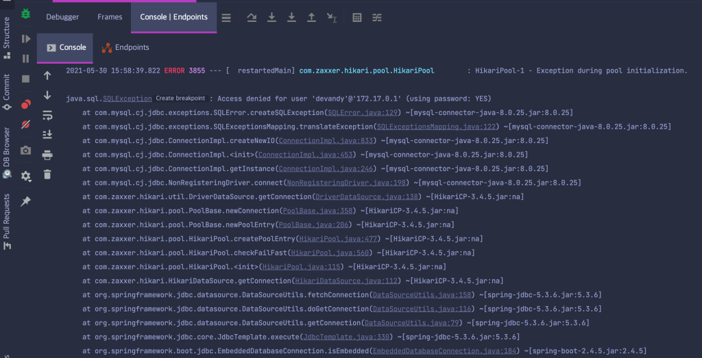

`SQLException`이 발생했고, 에러 로그를 보니 `Access denied for user 'devandy@172.17.0.1'` 이 로그에 찍힌걸로 보아 devandy라는 DB 사용자 계정에 접근할때 문제가 발생했음을 알 수 있었습니다. 스택오버플로우를 통해서 이런 경우, DB 사용자계정에 대한 privileges로인한 문제일 수 있다고 하여 MySQL 컨테이너에 접속하였습니다.

Privileges를 수정하기 위해 시도하였으나 해당 사용자가 테이블에 존재하지 않아서 권한을 부여할 수 없었습니다. 그래서 사용자를 다시 생성하려고 하였으나 이번엔 아래와 같은 에러 로그가 출력되었습니다. 

~~~
ERROR 1396 (HY000): Operation CREATE USER failed for 'devandy'@'localhost'
~~~

사용자 목록에서는 보이지 않았으나 이런저런 테스트하는 과정에서 DB에 한 번 생성된적이 있는 `devandy` 라는 계정이 완전히 삭제된것 같지 않았습니다. 그래서 아래의 명령어로 완전히 삭제이후에 다시 생성했습니다.

~~~sql
DROP USER 'devandy'@'localhost'
flush privileges;
CREATE USER 'devandy'@'localhost' IDENTIFIED BY 'password';
~~~

쿼리가 OK 되었음을 확인하고, 이제 권한을 부여하였습니다.

~~~sql
GRANT ALL privileges on lecturepedia.* to devandy@'localhost';
~~~

외부에서 접근할 수 있도록 '%'도 모든 권한을 부여했습니다.

~~~sql
CREATE USER devandy@'%' identified by 'password';
GRANT ALL privileges on lecturepedia.* to devandy@'%';
~~~

다시 Debug로 실행하니 이번엔 SEQUENCE 에러가 발생했습니다. 검색을 해보니 JPA 관련 에러였는데, application.properties에서 JPA플랫폼을 MySQL로 하지않아서 발생한 문제였습니다.

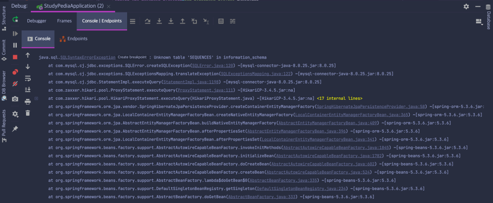

~~~properties
# spring.jpa.database-platform=org.hibernate.dialect.H2Dialect
spring.jpa.database-platform=org.hibernate.dialect.MySQL5InnoDBDialect
~~~

이렇게까지 수정하고 다시 애플리케이션을 실행하면 제대로 실행되었습니다.

 

## [🔝](#toc)<a name="4">4. 프로젝트를 통해 배운 것</a>

### 4-1. 스프링 프레임워크에서의 DIP

OOP를 위해서 의존성을 외부에서 주입하는 형태로 자바 프로그래밍을 했는데, 스프링부트 프로젝트에선 `@Autowired` 어노테이션으로 DI를 쉽게 구현할 수 있었습니다. 의존성이 추가될때마다 개발자가 직접 생성자에 파라미터를 추가할 필요없이, 어노테이션을 사용하면 쉽게 의존성을 외부에서 주입받도록 설계할 수 있었습니다.

`@Autowired`를 할 수 있는 대상은 스프링 프레임워크에서 관리하는 Bean으로 한정되는데, 이 때도 역시 어노테이션(`@Controller`, `@Service`, `@Component`)을 통해 쉽게 Bean을 등록할 수 있었습니다. 

MVC 패턴에 무관한 객체는 개발자가 따로 빈으로 주입해야 하는데, 이때 `@Component`는 클래스를, `@Bean`은 메소드를 대상으로 사용할 수 있다는것도 학습할 수 있었습니다.

### 4-2. JPA 장점

JPA를 처음 사용해보았는데, 개발자가 일일히 쿼리를 작성할 필요없이 JpaRepository를 상속받는 Repository 인터페이스를 생성해서 메소드 이름만으로 쿼리가 자동으로 생성되는 일이 매우 흥미로웠습니다. 

처음엔 JPA가 익숙치 않다보니 아래처럼 JPQL을 사용하여 직접 쿼리를 작성해서 이용도 해보았지만, JPA를 사용하니 SQL 오타에 대한 에러를 걱정하지 않아도 되니 더 편리하다는 느낌을 받았습니다.

~~~java
@Autowired
private EntityManager entityManeger;
...
@Override
public List<Lecture> getLectureMostView(int count) {
   String query = "SELECT lecture FROM Lecture ORDER BY lecture.views DESC";
   TypedQuery typedQuery = entityManager.createQuery(query, Lecture.class);
   typedQuery.setMaxResults(count);
   return typedQuery.getResultList();
}
~~~

 
